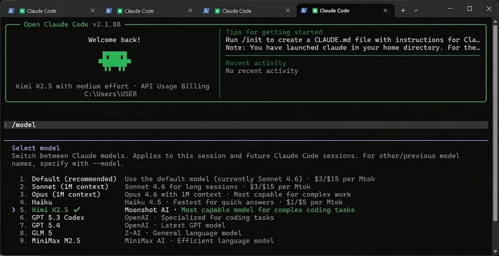

<h1 align="center">Open Claude Code</h1>

<p align="center">
  
</p>

## Quick Start

**Prerequisites:** [Bun](https://bun.sh) v1.1+

```bash
git clone https://gitlab.com/khaled7535043/open-claude-code.git
cd open-claude-code
bun install
bun run build
bun link
bun dist/cli.js
```

That's it. The CLI will launch and prompt you to authenticate via OAuth (same flow as the official Claude Code).

## Updating

To update Open Claude Code to the latest version, use one of the following methods:

### Method 1: Using the built-in update command (Recommended)

Run the update command from any terminal:

```bash
open-claude update
# or
/update
```

This command will automatically:
- Pull the latest changes from the main repository
- Rebuild the project
- Restart with the latest version

### Method 2: Manual update

If you prefer to update manually, run these commands in the project directory:

```bash
cd open-claude-code
git pull origin main
bun run build
```

## Commands

```bash
open-claude                    # Launch interactive REPL
open-claude --help             # Show all options
open-claude --version          # Show version
open-claude -p "your prompt"   # Non-interactive mode
open-claude auth login         # Authenticate
open-claude --model z-ai/glm5  # Use specify model

```

## To run Open Claude Code for free using a custom API, follow these steps:

**1. Register on [BlazeAI](https://blazeai.boxu.dev/) and obtain your API key.**

**2. Open a terminal (Command Prompt or PowerShell) and set the required environment variables:**

```bash
setx ANTHROPIC_BASE_URL "https://blazeai.boxu.dev/"
setx ANTHROPIC_API_KEY "sk-blaze-your-key-here"
setx ANTHROPIC_AUTH_TOKEN "sk-blaze-your-key-here"
```

**Replace `sk-blaze-your-key-here` with the API key you received from BlazeAI.**

**3. After the environment variables are set, start the application by running:** `open-claude`
   
**4. If prompted with “Do you want to use this API key,” select “Yes.”**

> **The project will now use the custom BlazeAI API endpoint for Open Claude Code.**

### Architecture

```
src/
├── main.tsx                 # Entrypoint (Commander.js CLI parser)
├── commands.ts              # Command registry
├── tools.ts                 # Tool registry (~40 tools)
├── QueryEngine.ts           # LLM query engine (Anthropic API)
├── context.ts               # System/user context collection
├── ink/                     # Custom Ink fork (terminal React renderer)
├── commands/                # Slash command implementations
├── tools/                   # Agent tool implementations
├── components/              # React UI components
├── services/                # API, MCP, OAuth, telemetry
├── screens/                 # Full-screen UIs (REPL, Doctor)
├── native-ts/               # Pure TS ports of native modules
│   ├── yoga-layout/         # Flexbox layout engine
│   ├── color-diff/          # Syntax-highlighted diffs
│   └── file-index/          # Fuzzy file search
└── vim/                     # Vim mode implementation
```

## Telemetry

By default, Claude Code sends telemetry to Anthropic (event logging, Datadog, GrowthBook). To disable all telemetry:

```bash
DISABLE_TELEMETRY=1 bun dist/cli.js
```

Or for maximum privacy:

```bash
DISABLE_TELEMETRY=1 CLAUDE_CODE_DISABLE_NONESSENTIAL_TRAFFIC=1 bun dist/cli.js
```

## Disclaimer

This repository contains proprietary source code that was unintentionally made public by Anthropic through their npm package distribution. It is provided here for educational and research purposes only.

- This project is **not affiliated with Anthropic**
- No warranty is provided, express or implied
- Users are responsible for their own compliance with applicable laws
- This repository may be subject to takedown at Anthropic's request
- **Do not use this for commercial purposes**
